# Parrot

<p align="center">
  
</p>

A browser extension that tells you whether the media you're browsing is already in your Plex library.

When you visit a movie or TV show page on a supported site, Parrot shows a badge indicating whether it's in your library, what rating it has, and — for movies — which other films in the same collection you're missing. Library items link directly to the content in Plex Web.

**Companion to [ComPlexionist](https://github.com/The-Ant-Forge/ComPlexionist)** — ComPlexionist finds gaps in your library; Parrot prevents you from hunting for something you already have.

---

## At a glance

<table>
  <tr>
    <td>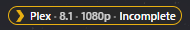</td>
    <td>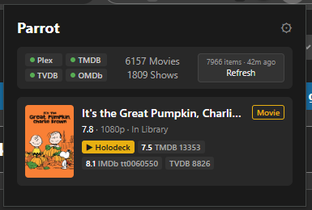</td>
  </tr>
  <tr>
    <td align="center"><em>The in-page badge — Plex, rating, resolution, and completeness for collections / series</em></td>
    <td align="center"><em>The popup — library counts, API status, and the current page's metadata</em></td>
  </tr>
</table>

---

## Features

- **Library status badge** on 16 supported sites — dark pill with gold/gray Plex chevron
- **Resolution display** — see media quality (SD, 720p, 1080p, 4K) on badges and the popup dashboard
- **Zero-config community proxies** — free Radarr and Sonarr proxies provide movie and TV metadata out of the box; no API keys needed for basic functionality, just configure your Plex server
- **Media ratings** — up to 6 sources for movies (TMDB, IMDb, Rotten Tomatoes, Metacritic, Trakt) and TVDB rating for TV shows
- **Deep linking** — badges link directly to the item in Plex Web
- **Collection gap detection** — see which movies from the same collection are in your library and which are missing
- **Episode gap detection** — on TMDB and TVDB TV show pages, see a season-by-season breakdown of missing episodes
- **Multi-server support** — configure multiple Plex servers with priority ordering
- **Remote access** — auto-detects your server's `.plex.direct` URL so the badge keeps working when you're away from home (requires Plex Remote Access enabled)
- **Dynamic toolbar icon** — gold border when the current page is in your library, gray when it isn't, light gray on unsupported pages
- **Built-in update flow** — gold "!" badge on the toolbar when a new release is on GitHub, with a one-click download from the options page

---

## Setup

### Prerequisites

- A Plex server with media libraries
- Your Plex authentication token ([how to find it](https://support.plex.tv/articles/204059436-finding-an-authentication-token-x-plex-token/))
- (Optional) A TMDB API key — the community proxy handles movie metadata and most ratings; a TMDB key adds TV show ratings and serves as a fallback ([get one free](https://www.themoviedb.org/settings/api))
- (Optional) A TVDB API key — the Sonarr proxy provides episode data; a TVDB key serves as a fallback for episode numbering ([get one](https://thetvdb.com/api-information))
- (Optional) An OMDb API key — the Radarr proxy provides IMDb ratings for movies; an OMDb key serves as a fallback ([get one free](https://www.omdbapi.com/apikey.aspx))

### Install from a release

1. Download the latest `parrot-X.Y.Z-chrome.zip` from the [Releases page](https://github.com/The-Ant-Forge/Parrot/releases/latest)
2. Unzip it to a folder you'll keep (the extension loads from disk, not from the zip)
3. Open `chrome://extensions/`, enable **Developer Mode**, click **Load unpacked**, and select the unzipped folder

### Install from source

```bash
npm install
npm run build
```

Then load in Chrome:

1. Open `chrome://extensions/`
2. Enable **Developer Mode**
3. Click **Load unpacked**
4. Select the `.output/chrome-mv3/` folder

### First-time configuration

Click the Parrot extension icon in the toolbar. You'll see the setup form:

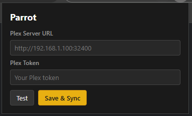

1. Enter your Plex server URL (e.g. `http://192.168.1.100:32400`)
2. Enter your Plex token
3. Click **Save & Sync** — Parrot will index your library

Once the library is indexed, browse to any supported site and the badge will appear next to the title.

### Options page

The options page gives you full control over Plex servers, API keys, gap detection thresholds, supported sites, and the update flow. Open it via the gear icon in the popup or via `chrome://extensions/` → Parrot → Details → Extension options.

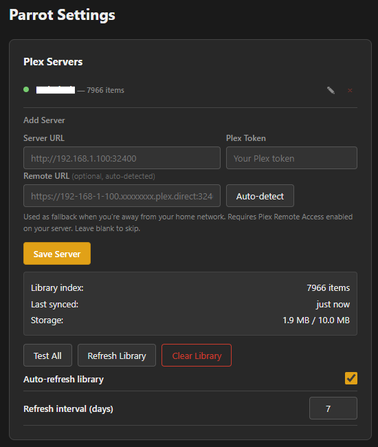

---

## How it works

1. Browse to a supported movie or TV show page
2. Parrot extracts the media ID from the page URL or DOM (via URL match, JSON-LD `sameAs`, or a link scan)
3. The ID is checked against an in-memory index of your Plex library (auto-refreshed every 7 days)
4. The badge appears next to the title showing library status, rating, and resolution
5. For movies in TMDB collections, a gap panel shows which titles you own and which are missing
6. For TV shows in your library, an episode gap panel shows missing episodes by season

### Badge states


Fields are separated by `·` and are added dynamically as data arrives:

| Pill | Meaning |
|------|---------|
| `[Plex]` (gray) | Not in your library |
| `[Plex]` (gold) | In your library (no extra data yet) |
| `[Plex · 7.2 · 1080p]` | In your library, with rating + resolution |
| `[Plex · 7.2 · 1080p · Complete]` | All collection movies / show episodes accounted for |
| `[Plex · 7.2 · 1080p · Incomplete]` | Some collection movies or show episodes missing |
| Red pill with tooltip | Error reaching Plex or the API |

The **Plex** part links to Plex Web. The **Complete / Incomplete** part toggles a floating gap panel anchored to the badge — no page layout shift.

### Collection gaps (movies)

When viewing a movie that belongs to a collection, Parrot shows a panel listing which films in the set are in your library and which aren't. This works even for movies not yet in your library — if the collection is partially complete, the badge upgrades to `Incomplete` with the full panel.

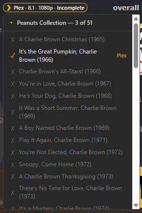

The check runs against the Radarr community proxy first (no API key required) and falls back to TMDB.

### Episode gaps (TV shows)

When viewing a TV show that's in your library on TMDB or TVDB, Parrot shows a collapsible season-by-season panel. Contiguous fully-complete or fully-missing seasons are grouped into ranges (e.g. `S1 - S12 269/269`); partial seasons list the missing episode numbers compactly (e.g. `S1 6/10 (e3-5, e10)`).

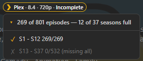

The check works out of the box via the Sonarr community proxy. It falls back to the TMDB or TVDB v4 API when configured.

### Popup dashboard

Click the toolbar icon on any media page to see a summary: library counts, server-link, ratings from every available source, collection info (when applicable), resolution, and show status (returning / ended) for TV.

<table>
  <tr>
    <td></td>
    <td>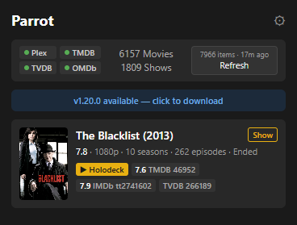</td>
  </tr>
</table>

---

## Supported sites

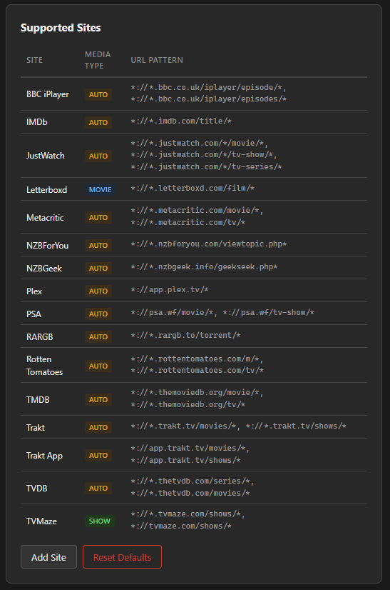

| Site | What Parrot reads |
|------|-------------------|
| **BBC iPlayer** | Title matching from URL slug + DOM title |
| **IMDb** | IMDb ID from URL |
| **JustWatch** | Title matching from h1 text |
| **Letterboxd** | TMDB/IMDb from page links |
| **Metacritic** | IMDb from JSON-LD `sameAs`, title matching fallback |
| **NZBForYou** | IMDb from page links, link scan fallback (TMDB/TVDB/TVMaze) |
| **NZBGeek** | TMDB/IMDb/TVDB from page links |
| **Plex** | PlexKey from URL (server items), link scan / title fallback (discover) |
| **PSA** | Title matching from URL slug |
| **RARGB** | TMDB/IMDb/TVDB from page links |
| **Rotten Tomatoes** | Title matching from URL slug |
| **TMDB** | TMDB ID from URL (movies + TV) |
| **Trakt** | TMDB/IMDb/TVDB from page links |
| **Trakt App** | TMDB/IMDb/TVDB from page links |
| **TVDB** | TVDB ID from page links (series + movies) |
| **TVMaze** | TVDB/IMDb via TVMaze API (shows only) |

---

## API keys (optional)

Most things work without any API keys thanks to the Radarr and Sonarr community proxies. Configure user keys only when you want fallbacks or extra data sources.

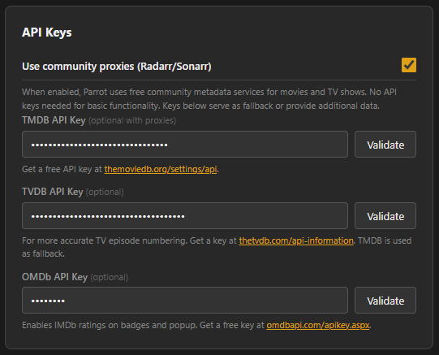

| Key | What it adds | When to bother |
|-----|--------------|----------------|
| **TMDB** | Movie + TV metadata fallback, TV episode counts, ratings | Recommended — fills in gaps from the proxies |
| **TVDB** | More accurate TV episode numbering for shows that differ between providers | Only if Sonarr proxy data looks off |
| **OMDb** | IMDb ratings for movies where Radarr lacks them | If you want IMDb scores on niche / new movies |

---

## Remote access

If you have **Plex Remote Access** enabled on your server, Parrot can keep working when you're away from home — no VPN, no port forwarding, no Plex Pass needed.

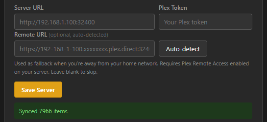

When you save credentials, Parrot calls the official `plex.tv/api/v2/resources` endpoint and auto-populates the **Remote URL** field with your server's `.plex.direct` URL. At runtime, the extension tries the local URL first, falls back to the remote URL on network failure, and remembers the working choice per server for the session.

You can also enter or edit the Remote URL manually — useful if your public IP changes or auto-detection fails. See [`docs/Remote Access.md`](docs/Remote%20Access.md) for the full design.

---

## Staying up to date

Parrot checks GitHub for new releases once a day. When an update is available, a gold "!" appears on the toolbar icon and an **Update Parrot** button shows up in the About card on the options page:

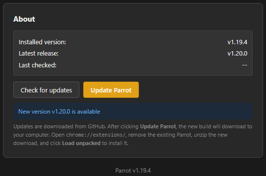

Clicking it opens the Chrome ZIP asset for the new release directly. After the download finishes, replace your existing unpacked folder with the new contents and click **Reload** on the Parrot card at `chrome://extensions/`.

Chrome doesn't allow side-loaded extensions to auto-install — this manual reload step is the trade-off for distributing outside the Chrome Web Store.

---

## Development

```bash
npm install            # one time
npm run dev            # dev mode with hot reload (Chrome)
npm run dev:firefox    # dev mode (Firefox)
npm run build          # production build
npm run zip            # build + zip for release
npm test               # run all tests
npm run lint           # lint
```

### Versioning

Version format: `Major.A.B` (e.g. `1.20.0`)

| Segment | Meaning | How it changes |
|---------|---------|----------------|
| Major   | Major version | Manual edit in `package.json` |
| A       | Commit number | `npm run version:commit` (resets B to 0) |
| B       | Build number  | Auto-incremented on every `npm run build` |

### Project layout

See [`CLAUDE.md`](CLAUDE.md) for a tour of the codebase, and [`docs/Parrot spec.md`](docs/Parrot%20spec.md) for the full specification including data flow, message types, and the URL resolution strategy.

---

## Tech stack

- TypeScript (strict mode)
- [WXT](https://wxt.dev/) — Vite-based browser extension framework
- Manifest V3
- Vitest (356 tests as of v1.25.0)

---

## License

MIT
